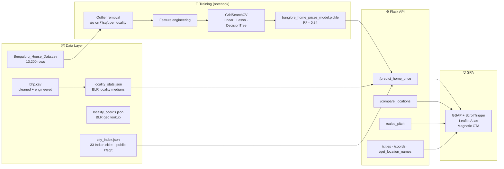

# 🏛️ Prophecy India — Property Intelligence Engine

> *Stop predicting. Start understanding.*

[](https://www.python.org/)
[](https://flask.palletsprojects.com/)
[](https://scikit-learn.org/)
[](https://greensock.com/gsap/)
[](https://leafletjs.com/)
[](#-run-with-docker)

A transparent ML engine that explains the **why** behind the **how much** — built on 13,200 Bangalore datapoints and extended to **33+ Indian cities** through public housing benchmarks.

---

## 📖 About the Project

**Prophecy India** is an advanced real-estate intelligence platform designed to bring transparency to the Indian housing market. Unlike traditional "black-box" calculators, Prophecy uses a multi-tiered inference engine to provide not just a price, but a mathematical justification for that price.

### The Core Problem
The Indian real estate market is notoriously fragmented. Price discovery often relies on word-of-mouth or opaque aggregator data. For a buyer, understanding whether a property is "fairly priced" requires analyzing locality medians, builder premiums, and market sentiment—all of which are rarely available in one place.

### The Prophecy Solution
This project solves the discovery problem through:
1.  **Localized Machine Learning**: A high-precision Linear Regression model trained on 13,000+ Bangalore records (R² 0.84) with per-feature contribution analysis.
2.  **Explainable AI (XAI)**: Every prediction is broken down into specific contributors (e.g., "Area added ₹X Lakhs," "Locality adjustment was -₹Y Lakhs").
3.  **Investment Scoring**: A 0–10 score that benchmarks the property against real-time locality or city-level pulses.
4.  **Pan-India Scalability**: Extended to 33 major Indian cities using a benchmark-driven "City Index" model.

---

## ⚡ Why This Stands Out

Most real-estate predictors are black boxes. Prophecy is **two engines in one**, each transparent about its method:

| Mode | When | How it works |
|---|---|---|
| 🧠 `ml-localized` | Bangalore + locality | Full LinearRegression model with 240 one-hot localities (R² 0.84). Per-feature contributions extracted directly from coefficients. |
| 🌏 `city-index`   | Any of 33 Indian cities | Public median ₹/sqft benchmarks × area + BHK/bath adjustment factors + sentiment multiplier. Honest, free, reproducible. |

Both paths return **the same shape of response**: price + ranked explanation + investment score + coords.

---

## 🏗️ System Architecture



---

## 📈 Model Performance

| Metric | Value |
|---|---|
| Bangalore algorithm | **LinearRegression** (selected via `GridSearchCV` over Linear / Lasso / DecisionTree) |
| Bangalore R² | **0.84** |
| Bangalore features | 243 (sqft, bath, BHK + 240 one-hot localities) |
| Bangalore training rows | ~10,500 (after outlier removal) |
| Pan-India coverage | 33 cities (Tier 1 + Tier 2 + select Tier 3) |
| City-index source | Public NHB Residex + aggregated listings (2024) |

---

## 🛠️ Technical Requirements & Setup

### Requirements
*   **Python**: 3.9+ (Tested on 3.11)
*   **OS**: Windows/macOS/Linux
*   **Memory**: ~500MB (Lightweight model)

### Installation Guide
1.  **Clone the repository**:
    ```bash
    git clone https://github.com/Vaishnavi-Dubey/prophecy-india.git
    cd prophecy-india
    ```
2.  **Install dependencies**:
    ```bash
    pip install -r requirements.txt
    ```
3.  **Run the application**:
    ```bash
    python server.py
    ```
    *Open [http://127.0.0.1:5000](http://127.0.0.1:5000) in your browser.*

### 🐳 Run with Docker
If you prefer containerized deployment:
```bash
docker build -t prophecy-india .
docker run -p 5000:5000 prophecy-india
```

---

## 🔌 API Reference

| Method | Endpoint | Body | Returns |
|---|---|---|---|
| `GET`  | `/get_location_names` | — | Bangalore localities |
| `GET`  | `/cities`             | — | 33 Indian cities + benchmarks |
| `GET`  | `/areas/<city>`       | — | Areas within a specific city |
| `POST` | `/predict_home_price` | `city, location?, total_sqft, bhk, bath, sentiment` | price + explanation + investment |

---

## 📁 Project Layout

```
prophecy-india/
├── server.py                          # Flask API + static SPA host
├── util.py                            # 2-mode inference, XAI, scoring, pitch
├── app.html / app.css / app.js        # Redesigned SPA (GSAP + Leaflet)
├── banglore_home_prices_model.pickle  # trained sklearn model
├── city_index.json                    # 33 Indian cities · public benchmarks
├── city_areas.json                    # 346 curated areas across India
├── price-prediction.ipynb             # training + EDA notebook
├── requirements.txt
└── README.md
```

---

## 🙌 Credits

Built by **[Vaishnavi Dubey](https://github.com/Vaishnavi-Dubey)**.
Bangalore dataset: [Bengaluru House Price Data (Kaggle)](https://www.kaggle.com/datasets/amitabhajoy/bengaluru-house-price-data).
City benchmarks: aggregated public NHB Residex + listing medians (2024).

> [!NOTE]
> The previous `price_prediction` repository should be deleted manually from your GitHub settings as current API tokens do not have administrative `delete_repo` scopes.

---
© 2026 Prophecy India. Property Intelligence Reimagined.
